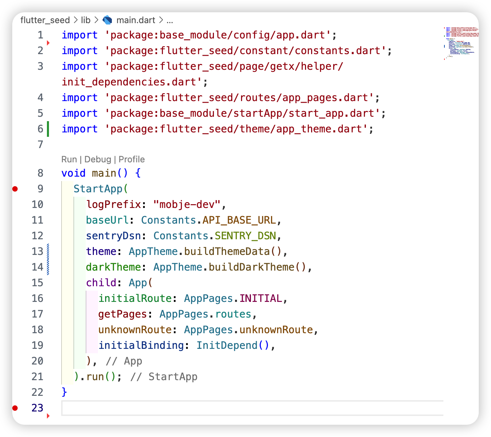
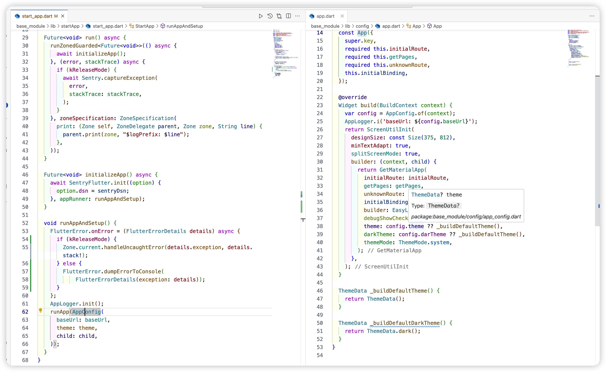

# flutter_quick_start

### **flutter_quick_start** 是一个快速开发flutter应用模板工程，该工程包含两个工程

- flutter_seed

    - Flutter_seed: 是快速开发flutter应用的种子工程，其中内部实现了 屏幕适配、自定义日志前缀 、崩溃拦截/Crash上报、环境动态切换、动态主题(在线编辑，实时查看)、路由动态扫描
    - 使用Getx的各种demo

- base_module

   - base_module: 提供flutter应用所需基础能力，比如网络请求封装、占位图组件、日志组件、环境动态切换、日志崩溃收集、 ......。

  

flutter应用在启动时会通常会调用**main.dart**文件的**runApp**方法，以下是使用**flutter_seed**与不使用**flutter_seed**，main.dart文件中代码两的对比

**<u>使用了flutter_seed:</u> 代码量如下:**

**不使用flutter_seed，自己实现，代码量如下:**

